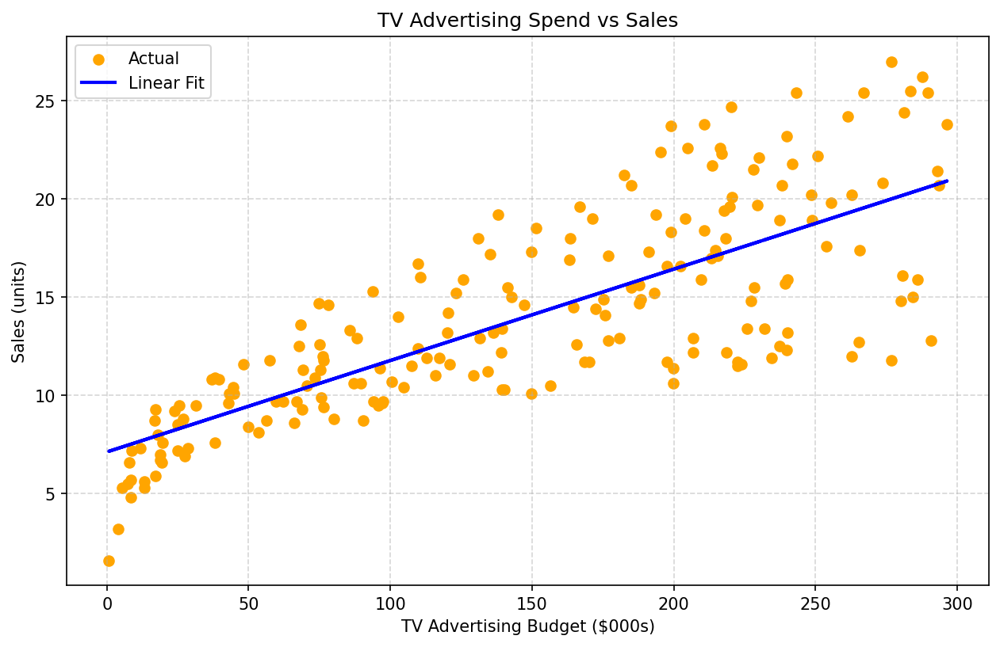

# TV Advertising Spend vs Sales Prediction

A machine learning project that uses **Simple Linear Regression** to predict sales revenue based on TV advertising budget. Built as part of an ongoing journey learning supervised machine learning, applying it across astronomy and finance domains.

---

## Project Overview

This project investigates the relationship between TV advertising spend and sales performance using the classic Advertising dataset. By fitting a linear regression model, we determine how much each additional dollar spent on TV advertising contributes to sales — providing a quantitative, data-driven measure of advertising effectiveness.

---

## Dataset

- **Name:** Advertising Dataset (Classic)
- **Original Source:** James, G., Witten, D., Hastie, T., and Tibshirani, R. *An Introduction to Statistical Learning*. Springer, 2013.
- **Kaggle Upload:** tawfik elmetwally
- **Size:** 200 observations
- **Features Used:**

| Column | Description |
|--------|-------------|
| `TV` | TV advertising budget in $000s |
| `Sales` | Sales revenue in units |

---

## Method

- **Algorithm:** Simple Linear Regression (single input feature)
- **Library:** scikit-learn
- **Split:** 80% training / 20% testing (random_state=42)

---

## Results

| Metric | Value |
|--------|-------|
| R² Score | 0.677 |
| MAE | 2.44 units |
| RMSE | 3.19 units |
| MSE | 10.20 |

**Interpretation:**
- The model explains **67.7%** of the variation in sales from TV budget alone
- On average predictions are off by **2.44 sales units**
- RMSE ≈ MAE indicating no catastrophically wrong predictions — errors are consistent throughout the budget range
- The plot shows a clean, homoscedastic relationship — unlike house price data, the spread around the regression line remains consistent across all budget levels

---

## Key Finding

The model slope (coefficient) tells us the **advertising effectiveness rate** — how many additional sales units are generated per $1,000 increase in TV advertising spend. This is the core business insight the model provides.

---

## Visualisation



The scatter plot shows a consistent linear trend throughout the full budget range ($0–$300K), with uniform spread above and below the regression line — indicating the linear model is appropriate for this data.

---

## Project Structure

```
tv-sales-linear-regression/
│
├── advertising.csv          # Dataset
├── Predicting_Monthly_Sales_from_Advertising_Spend.ipynb  # Jupyter notebook with full analysis
├── plot.png                 # Scatter plot with regression line
└── README.md                # This file
```

---

## How to Run

```bash
# Clone the repository
git clone https://github.com/yourusername/tv-sales-linear-regression.git
cd tv-sales-linear-regression

# Install dependencies
pip install numpy pandas matplotlib scikit-learn

# Open the notebook
jupyter notebook Predicting_Monthly_Sales_from_Advertising_Spend.ipynb
```

---

## Dependencies

- Python 3.x
- numpy
- pandas
- matplotlib
- scikit-learn

---

## Part of a Larger ML Journey

This project is part of a series of machine learning projects being built while completing the [Supervised Machine Learning: Regression and Classification](https://www.coursera.org/learn/machine-learning) course on Coursera. Projects span two domains:

**Astronomy**
- Blazar outburst energy injection rate (AO 0235+164, 2008 flare) 

**Banking & Finance**
- TV advertising vs sales (this project)


---

